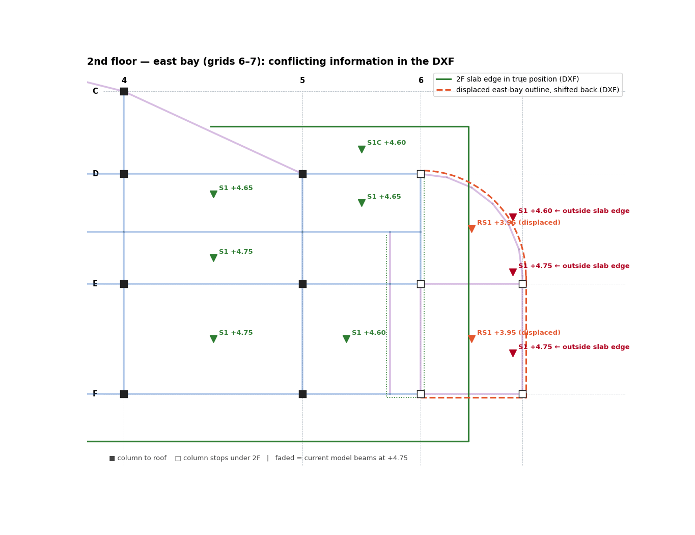

# 01 · Drawing Intake

Goal: know exactly what the drawings contain, where each piece of information lives, and
which questions the engineer has to answer, **before** any geometry is extracted.

Inputs used on the fire station:

| Source | Content | How it is read |
|---|---|---|
| `ST-Plan-<building>.dxf` | Foundation, ground-beam, 2F, 3F and roof framing plans on **one wide sheet** | `ezdxf` (geometry, text, block attributes) |
| Structural detail PDF | Column schedule (sheet S2-02, PDF p7), beam schedule (S2-04, p9), slab details | Rendered to PNG with PyMuPDF (`fitz`) and read visually |
| Architectural plan PDF (`B - Floor Plan.pdf`, A1-01…A1-04) | Room names and functions per floor | Rendered to PNG; Thai text does **not** extract, so pages are read as images (see [07](07_AR_PLAN_ROOM_MAPPING.md)) |
| Building regulation PDF | Live-load table (Ministerial Regulation B.E. 2566, clause 11) | `fitz` text extraction (the sara-am vowel comes out garbled; still readable) |

---

## 1. First pass over the DXF (`dxf_review.py`)

Print, in this order:

1. **Version, encoding, `$INSUNITS`.** Fire station: AC1024 (AutoCAD 2010), mm.
2. **Layers.** Identify the structural ones by name. Typical Thai-office layer set:

   | Layer | Holds |
   |---|---|
   | `S-CONT_BEAM`, `S-HID_BEAM` | Beam edges (continuous / hidden) as MLINE, LINE or LWPOLYLINE |
   | `S-CONT_COL`, `S-Column_H` | Column block inserts |
   | `S-EDGE_SLAB` | Slab edges and opening outlines (closed LWPOLYLINE) |
   | `S-GRID` | Opening diagonals (2-point LWPOLYLINE crossing an opening) |
   | `…$Grid`, `…$BALL` (inside the grid xref) | Grid lines and grid bubbles |

3. **Entity counts by type and by layer.** Tells you which extraction routes you need
   (MLINE vs LINE pairs vs polylines).
4. **Block inserts.** Column blocks, level symbols (`Sym-SFL`, `sym_slab`, `Sym-LEVEL`),
   footing tags, xrefs (`Xr-Grid-…`, `Xr-Title Block-…`).

## 2. Several plans on one sheet → panel origins

Office sheets often lay all plans side by side. Find each plan's origin from the **grid xref
inserts**: every plan has its own `Xr-Grid-…` insert, and the insert point minus the xref's
internal offset to grid 1 is that plan's origin.

```python
xr = sorted(e.dxf.insert.x for e in msp
            if e.dxftype()=="INSERT" and e.dxf.name.startswith("Xr-Grid"))
O  = [x - 33 for x in xr]        # fire station: grid 1 sits 33 mm right of the insert
# -> [0, 45778, 91555, 137333, 183111]  = FDN, GB, 2F, 3F, RF
def panel(x): return min(range(len(O)), key=lambda i: abs(x - O[i] - 13000))  # 13000 ≈ half plan width
```

Every coordinate read from the DXF is then converted to **plan-local** coordinates by
subtracting the panel origin. From this point on, all levels share one coordinate system.

## 3. Text, marks and level tags (`dxf_text.py`, `dxf_titles.py`)

- **Member marks** are plain `TEXT` (`GB1`, `B1A`, `B2`, `BX`, `F4,C2` …). Match with a regex
  such as `^(GB\d\w*|B\d\w*|BX\w*)$`. Keep the text **rotation**: 0° labels belong to
  horizontal beams, 90° labels to vertical ones.
- **Level tags** are block inserts with attributes. `Sym-SFL` carries the slab level (`+4.75`)
  and the slab type (`S1`, `RS1`, `S1C` …). Collect them per panel; the counts tell you the
  typical level and the local steps.
- **Plan titles** are the large texts (height ≥ 150 or title layers). Use them to confirm which
  panel is which floor.

## 4. Render the plans (`dxf_render.py`)

Render each panel with the `ezdxf` drawing add-on and **`TextPolicy.IGNORE`**: Thai SHX text
otherwise renders as garbage and slows the render. This render later becomes the grey
background of every review sheet (`ColorPolicy.CUSTOM`, fg `#c9ced4`).

```python
cfg = Configuration(text_policy=TextPolicy.IGNORE,
                    color_policy=ColorPolicy.CUSTOM, custom_fg_color="#c9ced4")
Frontend(RenderContext(doc), MatplotlibBackend(ax), config=cfg).draw_layout(msp, finalize=False)
ax.set_xlim(O[p]-4000, O[p]+31800)          # clip to one panel
```

## 5. Look for things that are not where they should be

Compare the same bay across all panels. On the fire station the 2F panel held the whole east
bay (grids 6–7 × F–D: 5 column symbols, slab edge, curved corner, beam lines) **shifted by
(+2,645, +7,802) mm**, outside the grid.

How to handle a displaced group:

1. **Detect**: geometry outside the grid extents, or column symbols with no grid intersection.
2. **Measure the shift** from one unambiguous feature (a column symbol) to its true position.
3. **Read its level tags before deciding it is an error.** Here the displaced group was tagged
   `RS1 +3.95`: it was the **annex roof, drawn aside on purpose** because the 2F overhang
   covers it in plan. It became its own level (see [03 §8](03_BEAM_LAYOUT.md)).
4. Transform it back in code (`loc(x, y)` subtracts the shift for points inside the group's
   window) so every later check compares like with like.


*The 2F east bay as found: true 2F slab edge (green), the displaced group shifted back (dashed red), and its RS1 +3.95 tags that revealed the annex roof.*

## 6. Schedules → sections

Read the column and beam schedules from the detail PDF and build a section table **before**
tracing. Every beam mark found in the DXF must map to a section; a mark missing from the
schedule is a decision item.

| Fire station | Mark | Size (b × h, mm) | MIDAS SECT |
|---|---|---|---|
| Columns | C1 / C1 footing stub | 250×250 / 350×350 | 101 / 102 |
| | C2 / C2 footing stub | 250×400 / 350×500 | 103 / 104 |
| Ground beams | GB1, GB1A, GB1C | 250×800 | 201, 202, 203 |
| Floor beams | B1, B1A, B1C, B2 | 250×600 | 204, 205, 206, 207 |
| | BX (stair trimmer) | – | 208 (not used: BX neglected) |
| | B2A | **not in schedule** → assumed 250×600 | 209 |

Sections are written as `DBUSER` solid rectangles, `SHAPE "SB"`, `vSIZE [H, B]` in metres
(`mksections_fs.py`).

## 7. Output of the intake: the review and the decision list

Send the engineer a short drawing review (plans found, member inventory, anomalies) and the
**decision list** from [DECISION_LOG_TEMPLATE.md](DECISION_LOG_TEMPLATE.md). Do not extract
geometry that depends on an unanswered question.

## Checklist

- [ ] Units and version confirmed
- [ ] Structural layers identified; extraction routes known (MLINE / LINE pairs / polylines)
- [ ] Panel origins found; panel ↔ floor confirmed from titles
- [ ] Marks, level tags and slab types collected per panel
- [ ] Every panel rendered as a background image
- [ ] Displaced or duplicated groups detected and explained
- [ ] Section table complete; missing marks flagged
- [ ] Decision list sent
