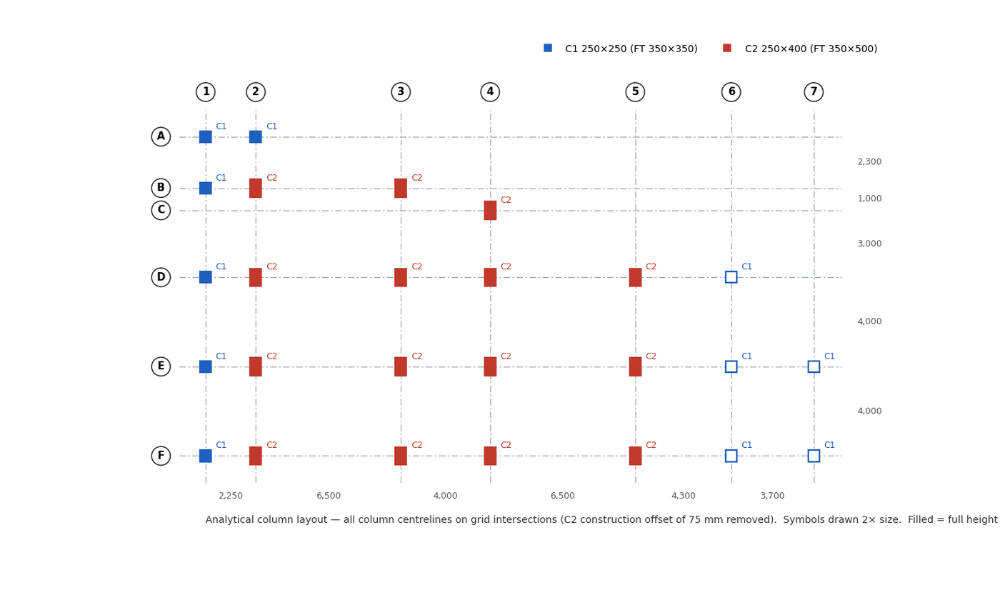
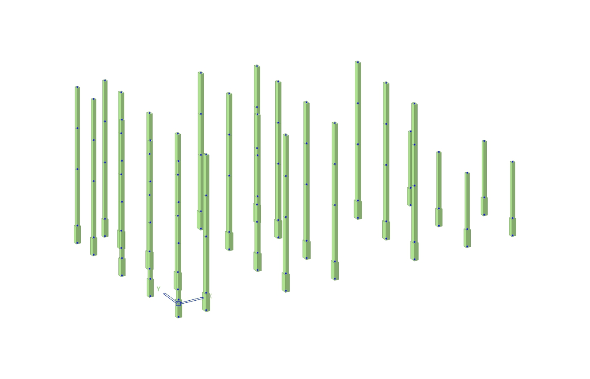

# 02 · Grid and Columns

Goal: an exact grid, every column on a grid intersection with the right section and the right
top level, written to MIDAS as the skeleton that every later level hangs from.

---

## 1. Grid from the xref (`dxf_grid_probe.py`, `dxf_grid_cols.py`)

Grid lines and bubbles are usually **not** in modelspace; they live inside the grid xref block
(`Xr-Grid-…`). Walk the insert recursively with `virtual_entities()` (keeps the transforms):

```python
def walk(ents, depth=0):
    for e in ents:
        yield e
        if e.dxftype()=="INSERT" and depth < 6:
            try: yield from walk(e.virtual_entities(), depth+1)
            except Exception: pass

for e in walk(grid_inserts):
    if e.dxftype()=="LINE"   and e.dxf.layer.endswith("$Grid"): ...   # grid line
    if e.dxftype()=="INSERT" and e.dxf.layer.endswith("$BALL"): ...   # bubble: label in attribs,
                                                                     # or TEXT inside the block
```

- Vertical lines (|Δx| < 1 mm) give the number grids, horizontal lines the letter grids.
  Inclined grid lines are printed separately for review.
- Label each line from the nearest bubble.
- Cross-check the spacings against the grid **dimensions** in the xref (`DIMENSION.get_measurement()`).

Fire-station result (mm, grid 1 / F = origin):

| Axis | Grids | Coordinates |
|---|---|---|
| X | 1…7 | 0 · 2,250 · 8,750 · 12,750 · 19,250 · 23,550 · 27,250 |
| Y | F…A | 0 · 4,000 · 8,000 · 11,000 · 12,000 · 14,300 |

Store the grid once (`GX`, `GY` dicts) and use it everywhere: snapping, sheets, zones.

## 2. Column detection (`dxf_colvis.py`, `dxf_cols_allfloors.py`)

Columns are **dynamic block** inserts (`*U115`, `*U116` …, from `Col-Continuous`,
`Col-Break`). A dynamic block carries every visibility state; its bounding box over *all*
entities is wrong.

- Take the bounding box over **visible** entities only (`e.dxf.get("invisible", 0) == 0`).
- Swap width and height when the insert rotation is 90° / 270°.
- The layers of the visible entities tell the symbol type: continuous, **stop-under**
  (column ends below this floor), sits-on-beam.
- Assign each insert to its panel, then to the nearest grid intersection, and record the
  offset `(dx, dy)` from that intersection.

The result is a table **grid cell × floor** with size, offset and symbol type:

```
grid        Foundation       Ground-beam       2nd floor        3rd floor        Roof
F2   350x500 d(0,75)   250x400 d(0,75)   250x400 d(0,75) ...
F6   350x350 d(0,0)    250x250 d(0,0)    stop-under ...
```

Use it to answer three questions per column: **mark** (C1 / C2 by size), **offset**, and
**top level** (the floor where the stop-under symbol appears, or where the column disappears).

## 3. Snap to grid (analysis position)

Fire station: C1 sat exactly on the intersection; C2 sat on the number grid but **75 mm off
the letter grid** (its face aligned with the C1 face line). The engineer's rule:

> Every column centreline on its grid intersection. The construction offset is a detailing
> matter, not an analysis one.

Record the rule and the removed offsets on the column sheet. If a project needs the true
eccentricity, keep the node on the grid and use a section offset instead of moving the node,
so beams still frame in on the grid.

## 4. Levels

Collect the `Sym-SFL` tags per plan. The **typical** level is the most frequent value; the rest
are local steps (toilets, balconies) and are ignored for the analytical level.

| Level | Z (m) | Source |
|---|---|---|
| Base | −1.00 | Pile-cap top (1.0 m below ±0.000); fixed supports |
| GF / ground beams | +0.35 | Ground-floor SFL |
| 2F | +4.75 | 11 of 22 tags (+4.60 / +4.65 are local drops) |
| 3F | +7.95 | Majority (+7.80 / +7.85 local) |
| RF | +11.15 | Roof SFL |
| Annex roof | +3.95 | `RS1 +3.95` on the displaced annex group |

## 5. Column model (`prep_columns.py`, offline)

- One node per column per level up to its top; one element per storey.
- The segment from the base to GF uses the **footing (stub) section**; everything above uses the
  GF section, unless the schedule changes it.
- β angle 0: C2 has its 250 side along X and its 400 side along Y, as drawn. Check this
  against the plan for every rotated column.

**ID scheme** (keeps IDs readable in MIDAS tables):

| Item | Rule | Example |
|---|---|---|
| Column index | 1…n, sorted by row (F→A) then grid (1→7) | F1 = 1 … A2 = 26 |
| Node | level digit × 1000 + column index | 3014 = E7 at 2F |
| Column element | lower level digit × 1000 + index | 2014 = E7, GF→2F |
| Level digits | base 1, GF 2, 2F 3, 3F 4, RF 5, annex 6 | |

Produce a plan figure (`fs_col_plan.png`: grid, bubbles, spacings, C1/C2 symbols, hollow for
columns that stop early) for the engineer to accept.


*Column plan for acceptance: all columns on grid intersections; hollow = stops under 2F.*

## 6. First write (`build_columns.py`)

Order: material → nodes → elements → supports → groups, then read everything back.

```python
PUT /db/MATL  {"1": {"TYPE":"CONC","NAME":"C280","PARAM":[{"P_TYPE":1,"STANDARD":"TIS(RC)","DB":"C280"}]}}
PUT /db/NODE  {id: {"X","Y","Z"}}                                   # metres
PUT /db/ELEM  {id: {"TYPE":"BEAM","MATL":1,"SECT":s,"NODE":[i,j],"ANGLE":0,"STYPE":0}}
PUT /db/CONS  {base_node: {"ITEMS":[{"ID":1,"CONSTRAINT":"1111111","GROUP_NAME":""}]}}
PUT /db/GRUP  COL_C1, COL_C2, COL_FT_STUB, COL_GF-2F, COL_2F-3F, COL_3F-RF, NODE_BASE
```

Read back and print: node count, element count, supports, elements by section, nodes by Z.
Fire station: 120 nodes, 94 column elements, 26 supports.


*Read-back after the first write: 26 columns in MIDAS.*

## 7. Later column changes (split levels)

When a level appears between two floors (the annex roof at +3.95):

- **Split** the columns that continue through it: move the lower element's J node to the new
  node, add an upper element from the new node to the old top node.
- **Shorten** the columns that stop under it: move the J node down, then delete the old top node
  (`DELETE /db/NODE/<id>`).
- Add the new pieces to the existing column groups.

## Pitfalls

- Bounding box over all entities of a dynamic block → wrong column size.
- Taking the first SFL tag found as the floor level → a local step becomes the floor.
- A column that "disappears" on an upper plan may be a stop-under symbol on another plan
  or a displaced copy ([01 §5](01_DRAWING_INTAKE.md)); check before shortening it.
