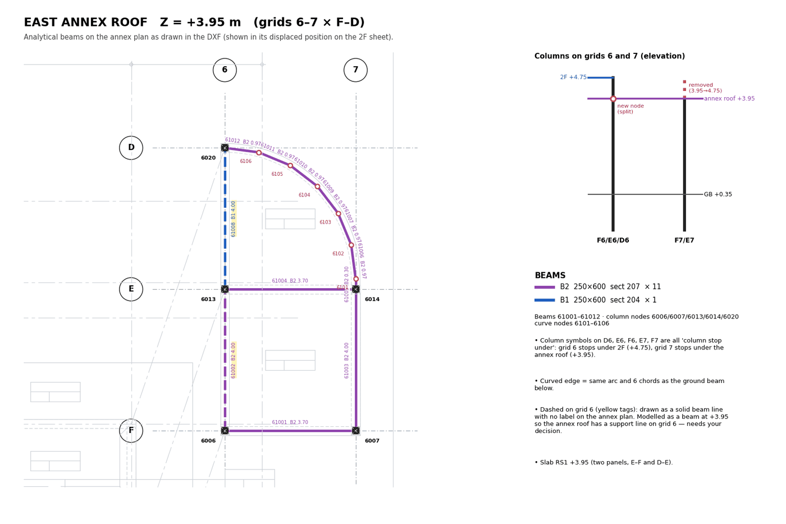
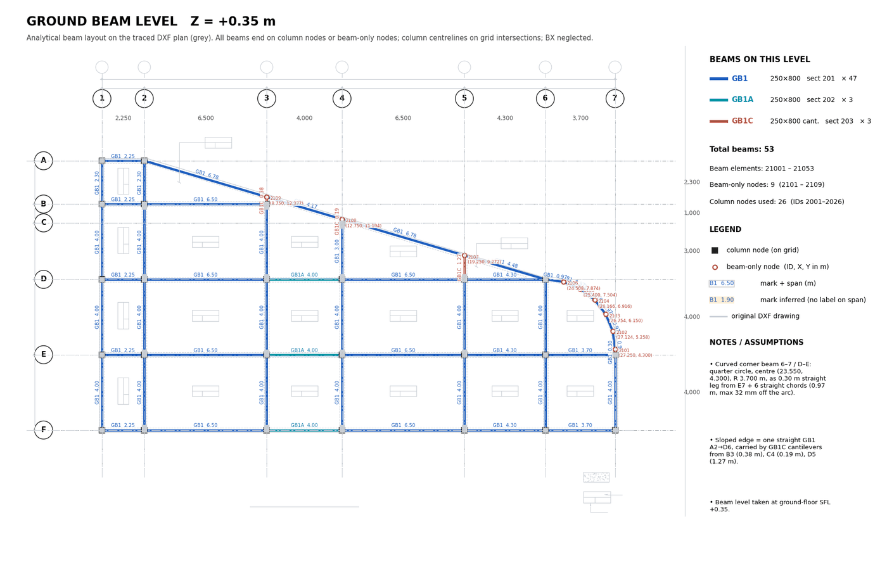

# 03 · Beam Layout Mapping

Goal: for each level, a clean analytical beam graph: centrelines that end exactly on column
nodes or on shared beam-only nodes, split at every junction, each span carrying a section mark.

Stages, all offline, in mm, per level:

```
raw DXF ─► centre-segments ─► marks ─► level fixes ─► snap ─► cluster ─► extend ends
        ─► split at junctions ─► dedupe ─► mark per span ─► infer missing marks
        ─► remove trimmers + merge ─► connectivity check ─► IDs ─► review sheet
```

---

## 1. Centre-segments from the DXF (`dxf_beams.py`)

Beams are drawn in three ways; handle all three on the beam layers (`S-HID_BEAM`,
`S-CONT_BEAM`).

**MLINE** (a multiline drawn with its width): the vertices are on the *reference* line, not the
centreline. Shift by the justification:

```python
half = e.dxf.scale_factor / 2
sh = {0: -half, 1: 0.0, 2: +half}[e.dxf.justification]   # 0 top, 1 zero (centre), 2 bottom
nx, ny = -dy/L, dx/L                                     # left normal of each vertex pair
centre = (a.x + sh*nx, a.y + sh*ny) … (b.x + sh*nx, b.y + sh*ny)
```

**LINE / LWPOLYLINE edge pairs**: two parallel edges of one beam. Pair them when
`|sin(angle difference)| < 0.02` and their perpendicular distance is **200–300 mm** (beam width
250 mm). The centreline is the mean of the aligned end points. Unpaired edges are printed for
review; they are usually slab edges or one-sided lines at a wall.

**Bulged LWPOLYLINE** (any vertex with bulge ≠ 0): a **curved beam**. Do not pair its
vertices; handle it with [04_CURVED_BEAMS.md](04_CURVED_BEAMS.md).

Plot the raw segments over the grid (`fs_beams_raw.png`) before any clean-up; it shows what the
extraction really found.


*Raw centre-segments per level before clean-up; dotted `?` = no mark found yet.*

## 2. Marks

For each segment, pick the nearest mark text:

- projection of the text onto the segment within `[-300, L+300]` mm;
- perpendicular distance < 900 mm;
- a text whose rotation does not match the segment direction (0° for horizontal, 90° for
  vertical) gets +2,000 mm of penalty, so it only wins if nothing else is near.

No match → mark `?`, resolved later.

## 3. Level-specific fixes (record every one on the sheet)

Some drawings need a rule that is not generic. Write them as explicit, commented blocks so they
can be reviewed. Fire-station examples:

| Level | Fix | Why |
|---|---|---|
| GB | Replace the partial sloped edge by one straight GB1 **A2 → D6**, carried by **GB1C** cantilevers from B3, C4, D5 to that edge | The edge is one straight beam in reality; the drawing drew it in pieces |
| 2F | Shift the displaced east bay back by (−2,645, −7,802) | See [01 §5](01_DRAWING_INTAKE.md) |
| 3F | Unify the secondary line at Y = 5,750 → **5,900**; trim the edge B2 tail at X = 22,275 | Same line drawn at two positions |
| 2F, 3F | Y = 5,900 line completed to grid 1 with **B1** | Engineer's decision after BX removal |

## 4. Snapping and clustering

1. **Cross-axis snap to grid** (tolerance 200 mm): a horizontal segment's Y moves to the nearest
   letter grid, a vertical segment's X to the nearest number grid, if within 200 mm.
2. **Cluster off-grid lines** (30 mm): remaining off-grid X (or Y) values within 30 mm of each
   other are replaced by their mean, so secondary beams drawn a few mm apart share one line.
3. **Along-axis end extension**: an end moves to
   - the nearest crossing beam line or column within **350 mm**, else
   - the nearest column on the same line within **650 mm**
   (beams are drawn to the column *face*; the model needs the centre).
4. **Diagonal ends** snap to the nearest column node within **600 mm**.

Segments marked `fixed` in §3 are not snapped.

## 5. Split at junctions and dedupe

- Collect points: column nodes at the level, all segment ends, and every H×V crossing strictly
  inside both segments.
- Split every segment at each point lying on it (projection within the length, perpendicular
  distance < 5 mm).
- Dedupe by the sorted end-point pair. When two pieces coincide, keep the one with a real mark.

## 6. One mark per span, then inference

Re-run the mark match on each **span** (tighter projection window, `[-100, L+100]`), then:

| Source tag | Meaning | Sheet colour |
|---|---|---|
| `text` | a label sits on this span | white tag |
| `parent` | inherited from the drawn segment it was split from | yellow tag |
| `neighbour` | copied from a collinear neighbour sharing a node | yellow tag |
| `rule` | set by a stated rule (e.g. typical span → B1) | yellow tag |
| `user` | set by the engineer at review | green tag |

Every yellow tag is a question the engineer can see. Never hide an inferred mark.

## 7. Trimmers, merging and connectivity (`revise_beams_noBX.py`)

When the engineer decides to neglect a member class (fire station: **BX stair trimmers**):

1. Correct mislabelled pieces first (a `BX` span that is not on a trimmer line becomes `B1`).
2. Remove the class.
3. **Re-attach dead ends**: an end left with degree 1 and not on a column moves to the column
   on the same line within 650 mm (only if that makes the beam longer, never shorter).
4. **Merge** collinear, same-mark pieces meeting at a non-column node of degree 2. Repeat
   until nothing merges.
5. **Connectivity** (union-find): every connected beam group must touch at least one column
   node. A floating group is a stop.

Always start this step from the saved pre-removal set (`fs_beammodel_withBX.json`) so it can be
re-run safely.

## 8. A second level between floors (the annex)

When a bay has its own roof level (annex roof +3.95 under the 2F overhang):

- Remove its beams from the main floor and keep them in a backup list.
- Model it as its own level with its own level digit (6), group (`BEAM_AR`) and sheet.
- Resolve shared lines explicitly. Grid 6 needed a beam at **both** +4.75 (2F edge) and +3.95
  (annex roof support). The engineer chose **option A**: add grid-6 beams at +3.95 with the
  marks of the 2F beams above. Note on the drawings that the real member is probably one
  deep stepped beam.


*Annex roof +3.95 sheet: dashed yellow-tagged beams on grid 6 are the option-A beams (inferred marks).*

## 9. IDs and sections (`plot_floor.py`)

Stable IDs, so a re-run produces the same numbers:

| Item | Rule | Fire station |
|---|---|---|
| Beam-only node | level digit × 1000 + 101 + i, sorted by (Y, X) | 2101…2109 at GB |
| Beam element | level digit × 10000 + 1001 + i, sorted by midpoint (Y, X) | 21001…21053 at GB |
| Column nodes | reused from the column model | 2001…2026 at GB |
| Group | `BEAM_<L>` | `BEAM_GB` … `BEAM_AR` (GRUP 8–12) |

Section per mark from the section table in [01 §6](01_DRAWING_INTAKE.md).

Store per level: `z`, `colnodes`, `newnodes {id: [x, y] in m}`, `elems [{id, i, j, a, b, mark,
sect, len, src}]` in `fs_beammodel.json`. The writer reads only this file.

## 10. Result on the fire station

| Level | Z | Beams | Beam-only nodes |
|---|---|---|---|
| GB | +0.35 | 53 | 9 (6 on the curve, 3 cantilever tips) |
| 2F | +4.75 | 60 | – |
| 3F | +7.95 | 53 | – |
| RF | +11.15 | 34 | 0 |
| Annex roof | +3.95 | 12 | 6 (curve) |


*Ground-beam review sheet: beams over the grey DXF, mark + span on each beam, new nodes with ID and coordinates, notes panel.*

## Pitfalls

- Reading MLINE vertices as centrelines → every beam off by half its width.
- Pairing edges without the width window → a beam edge paired with a slab edge.
- Snapping before the level fixes → a deliberate off-grid line pulled onto the grid.
- Merging across a column node → a two-span beam becomes one element; never merge at `cn`.
- A curved polyline read by its vertices only → a straight chamfer (happened on GB first time).
