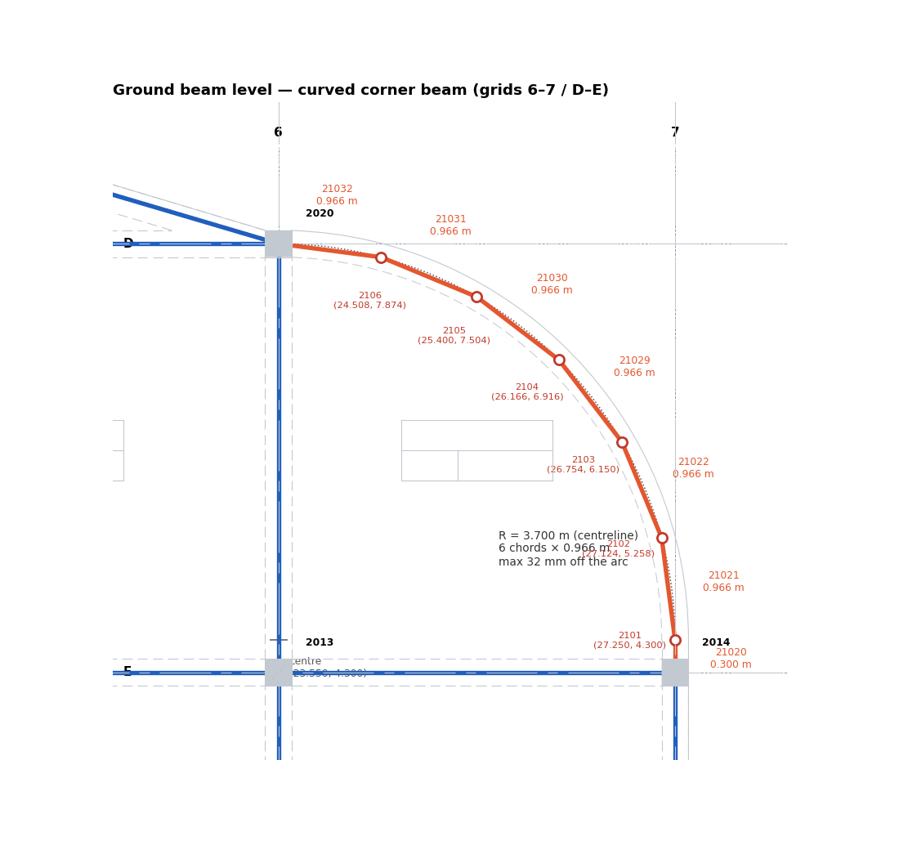

# 04 · Curved Beams → Straight Chords

MIDAS beam elements are straight. A curved beam is modelled as a chain of straight chords
whose nodes lie **on the true centreline arc**. This guide covers recovering the arc from the
DXF, choosing the number of chords, and keeping the chords consistent on every level that
shares the curve.

---

## 1. Spot the curve

In a DXF, an arc edge is usually an `LWPOLYLINE` with a **bulge** on a vertex, not an `ARC`
entity. Reading only the vertex coordinates turns the curve into a straight chamfer. That is
what happened on the fire-station GB level at first: the corner D6–E7 came out as one straight
beam.

```python
pts = list(e.get_points("xyb"))          # x, y, bulge
if any(abs(b) > 1e-6 for _, _, b in pts):  # curved beam -> handle here, not as an edge pair
```

Also look for `ARC` entities on the beam layers. After tracing, compare the traced graph with
the rendered plan: a straight line cutting a drawn curve is obvious on the review sheet.

## 2. Arc from bulge

For a segment p1 → p2 with bulge `b` (positive = counter-clockwise):

```python
def arc_from_bulge(p1, p2, b):
    th = 4 * math.atan(b)                       # included angle
    dx, dy = p2[0]-p1[0], p2[1]-p1[1]; c = math.hypot(dx, dy)
    R  = c / (2 * math.sin(th/2))               # radius
    h  = c / (2 * math.tan(th/2))               # centre distance from chord midpoint
    mx, my = (p1[0]+p2[0])/2, (p1[1]+p2[1])/2
    nx, ny = -dy/c, dx/c                        # left normal
    return (mx + h*nx, my + h*ny), R, th        # centre, radius, sweep
```

## 3. Centreline

The DXF draws the two **faces** (inner face on the beam layer, outer face often on a wall or
slab-edge layer). Build the centreline from them:

1. Compute centre and radius of both faces.
2. Centreline start/end = midpoints of the matching face end points.
3. Centreline arc = same bulge through those two points (concentric with the faces).
4. **Rationalise against the grid**: if the centre and radius fall on grid values within a few
   mm, use the grid values.

Fire station, corner 6–7 / D–E:

| Item | Value |
|---|---|
| Centre | (23,550, 4,300) = grid 6, 300 mm above row E |
| Centreline radius | 3,700 mm = the 6–7 bay |
| Sweep | 90° (quarter circle) |
| Arc start | (27,250, 4,300), on grid 7, tangent to it |
| Arc end | (23,550, 8,000) = **D6 column node exactly** |
| Straight leg | E7 (27,250, 4,000) → arc start, **0.30 m** along grid 7 |
| Arc length | 5.812 m |

## 4. How many chords

For a sweep θ divided into n equal chords of radius R:

- chord length `c = 2R·sin(θ/2n)`
- maximum gap between chord and arc (sagitta) `s = R·(1 − cos(θ/2n))`
- total chord length vs arc length: `n·c / (R·θ)`

Fire-station corner (R = 3.70 m, θ = 90°):

| n | Chord (m) | Sagitta (mm) | Length loss |
|---|---|---|---|
| 4 | 1.444 | 71 | 0.64 % |
| **6** | **0.966** | **32** | **0.29 %** |
| 8 | 0.726 | 18 | 0.16 % |
| 12 | 0.484 | 8 | 0.07 % |

**Rule used (6 chords):**

1. The sagitta stays well inside the beam: s ≤ b/8 (250/8 ≈ 31 mm). The chord line never
   leaves the real beam.
2. The chord is about **2× the slab mesh size** (0.966 ≈ 2 × 0.5 m). Auto-mesh then puts
   two plate edges on each chord with no sliver plates.
3. The length loss is below 0.5 %, so self-weight and stiffness barely change.

Offer the next finer option on the sheet (8 chords, 18 mm) so the engineer can choose.

## 5. Generate the nodes

Equal angle steps from the arc start. Snap the last point to the column node and **print the
shift** (it must be a few mm at most; on the fire station it was 0 mm):

```python
a0 = math.atan2(p1[1]-cc[1], p1[0]-cc[0])
pts = [(round(cc[0] + Rc*math.cos(a0 + th*k/n)),
        round(cc[1] + Rc*math.sin(a0 + th*k/n))) for k in range(n+1)]
print("end shift to column:", math.dist(pts[-1], D6)); pts[-1] = D6
poly = [E7] + pts                            # column -> straight leg -> chords -> column
```

Each chord becomes one beam element with the curve's mark (`GB1` / `B2`), tagged
`"curve": True` in the JSON. Rounding to whole mm is fine (fire-station points:
(27,250, 4,300) · (27,124, 5,258) · (26,754, 6,150) · (26,166, 6,916) · (25,400, 7,504) ·
(24,508, 7,874) · (23,550, 8,000)).


*The GB corner: 0.30 m leg from E7 plus 6 chords over the drawn curve.*

## 6. Same curve on another level

When the same curve appears on another level (the annex roof at +3.95 repeats the GB corner):

- **Reuse the same plan points** so the chords line up vertically.
- Guard it in code so a later change on one level cannot silently break the other:

```python
curve = {tuple(p) for e in GB["elems"] if e.get("curve") for p in (e["a"], e["b"])}
assert all(p in curve for p in arc), "GB curve points changed"
```

## 7. Verification of a curved beam

The DXF has no straight centreline to compare against, so the checker uses the arc
analytically:

```python
def arcdist(px, py):                          # distance from a point to the centreline arc
    return abs(math.hypot(px-23550, py-4300) - 3700) if (px > 23500 and py > 4250) else 1e9
```

- Every chord sampled every 250 mm must be within the tolerance of the arc (the sagitta, 32 mm,
  is well under the 260 mm "has DXF support" limit).
- The short straight leg may be flagged as "no DXF beam" because the drawing shows only its face
  line. That is a known false alarm; say so on the sheet.
- The review sheet gets a close-up of the curve (`fs_beams_GB_curve.png`): chords and nodes
  over the grey drawing.

## 8. Slabs next to a curve

The slab panel bounded by the chords is not rectangular, so Auto-mesh uses **Quad and
Triangle** for it (see [06](06_SLAB_AUTOMESH.md)). Fire station GB-P12: all quads except a
few triangles along the chords.

## Pitfalls

- Sign of the bulge: positive is counter-clockwise from p1 to p2. A wrong sign mirrors the arc
  outside the building.
- Chords computed from a face instead of the centreline → the whole curve is off by b/2.
- Different chord counts on two levels → the columns between them see mismatched nodes and
  the slab meshes differ.
