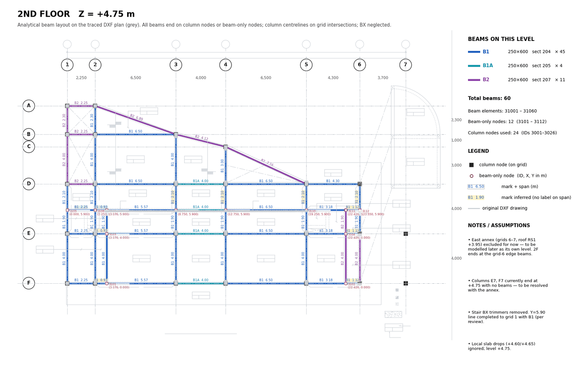
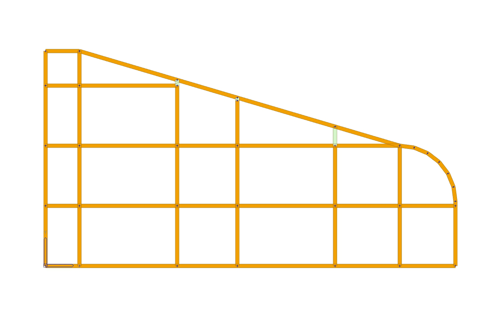

# 05 · Verification Before Writing to the Live Model

Nothing enters the live MIDAS model until it has passed four gates. This is what made the
fire-station model go in floor by floor with no rework on the geometry.

```
 Gate 1  Independent check against the DXF   (script, automatic, 5 checks)
 Gate 2  Review sheet over the drawing       (image, for the engineer)
 Gate 3  Engineer says "Go" for this level   (human)
 Gate 4  Pre-write checks on the live model  (script, aborts on any failure)
         ── write ──
 After   Read-back verification + backup kept
```

One level per cycle. The engineer starts each level's review; the next level is **not**
started until they ask for it.

---

## Gate 1 · Independent check (`verify_floor.py <L>`)

The checker re-reads the DXF from scratch with its own simple extraction (MLINE centrelines,
edge pairs, bulged polylines as analytic arcs) and compares it with the prepared model. It
shares no clean-up code with the tracer, so a tracing bug cannot hide itself.

| # | Check | Method | Pass |
|---|---|---|---|
| 1 | **DXF beam → model** | Sample each DXF centreline every 250 mm; a sample is covered if a model beam is within 200 mm. A beam is missing if > 30 % of samples are uncovered | 0 missing, except members excluded on purpose (listed with their labels) |
| 2 | **Model beam → DXF** | Sample each model beam every 250 mm; supported if a DXF centreline or the analytic arc is within 260 mm | 0 invented beams (known false alarms named) |
| 3 | **Labels vs marks** | Every DXF label matched to the nearest span (orientation rule as in tracing); compare text with the model mark | 0 mismatches, except labels of excluded members; unmatched labels listed |
| 4 | **Topology** | Crossings without a shared node (segment intersection strictly inside both); dangling ends (degree 1, not a column); column nodes not used | 0, 0, and every column at this level used |
| 5 | **Levels** | All `Sym-SFL` tags inside the panel: position, level, slab type | Typical level confirmed; local steps listed |

Output: a printed report and `verify_<L>.json` (the slab stage reuses the SFL list).

Fire-station 2F result, for scale: all non-BX DXF beams present, 0 invented, 51/51 non-BX
labels agree, 0 crossings, 0 dangling ends, 26/26 column nodes used, one level conflict (the
east bay) raised as a decision.

## Gate 2 · Review sheet (`plot_floor.py`)

One PNG per level, built so a reviewer can check every beam against the drawing without
opening CAD:

- **Background**: the original DXF panel in light grey (text ignored).
- **Grid**: dashed lines, bubbles, bay dimensions.
- **Beams**: coloured by mark, with `mark  span(m)` on each span.
  - white tag = label read from the drawing;
  - **yellow** tag = inferred mark (question for the reviewer);
  - green tag = set by the engineer.
- **Nodes**: black squares = column nodes; red circles = new beam-only nodes with **ID and
  (X, Y)** in metres.
- **Side panel**: level name and Z, counts per mark with section and size, element and node
  ID ranges, legend, and **NOTES / ASSUMPTIONS** listing every level-specific fix and every
  open question.
- Close-ups for anything special (the curve, the displaced bay).

The sheet is the contract: what the engineer approves is exactly what gets written.


*The 2F review sheet, the contract the engineer approves.*

## Gate 3 · The engineer's decision

Send the sheet, the check summary, and **numbered questions** with a recommendation for each.
Wait for "Go" (with or without changes). Changes go back through Gate 1 and a new sheet.

Examples of decisions that came out of this gate on the fire station:

- east bay 6–7 is a separate annex roof at +3.95 (not part of 2F);
- Y = 5.90 line completed to grid 1 with B1;
- grid-6 beams at +3.95 added (option A);
- BX trimmers neglected; B2A assumed 250×600.

## Gate 4 · Pre-write checks (`build_beams_level.py <KEY> <L>`)

Before any PUT, read the live model and abort if any of these fail:

| Check | Why |
|---|---|
| No **node-ID clash** with existing nodes | A PUT on an existing ID silently moves that node |
| No **element-ID clash** | Same for elements |
| Every **section** used exists | Otherwise the element is written with a missing property |
| Every referenced **column node exists** | A beam into a missing node fails or creates a stray node |
| Every referenced column node is at the **level Z** (± 1 mm) | Catches a level mix-up before it becomes a sloped beam |

```python
if clash_n or clash_e or missing_sect or missing_col or badz:
    sys.exit("ABORT: pre-check failed")
```

**Backup** before the first write of a stage: dump `NODE`, `ELEM`, `GRUP` (and any table the
stage touches) to JSON (`midas_backup_before_<stage>.json`). For big changes also save the
model under a new name in MIDAS (the connection then drops; reconnect with Apps → Connect).

## Write, then read back

Write order: nodes → elements → group. Then read the tables again and print:

- beams written / expected, count by section;
- **max length mismatch** between the model and the approved sheet (fire station: ≤ 0.5 mm);
- all beam nodes at Z;
- new nodes present / expected;
- model totals and group membership.

Finally capture a plan and an iso view from MIDAS (`/view/CAPTURE`) and show them next to the
approved sheet.


*Read-back capture from MIDAS after writing the ground-beam level: compare with the approved sheet.*

## Things the gates caught on the fire station

| Found by | Issue |
|---|---|
| Gate 2 (sheet) | Curved GB corner traced as a straight chamfer (bulge ignored) |
| Gate 1 check 5 | 2F east bay tagged `RS1 +3.95`: a separate annex roof, not 2F |
| Gate 1 check 1 | 2F annex beams drawn displaced; transform needed before comparing |
| Gate 1 check 3 | BX labels on spans that were really B1 after trimmer removal |
| Gate 4 / read-back | Per-level beam counts in a summary message were wrong; read-back gave the true numbers |

## Checklist per level

- [ ] `verify_floor.py` clean, or every exception explained
- [ ] Sheet produced; yellow tags and assumptions listed
- [ ] Questions answered; "Go" received
- [ ] Backup written
- [ ] Pre-write checks passed
- [ ] Read-back matches the sheet; screenshot sent
- [ ] Memory / notes updated with the level status and any new pitfall
