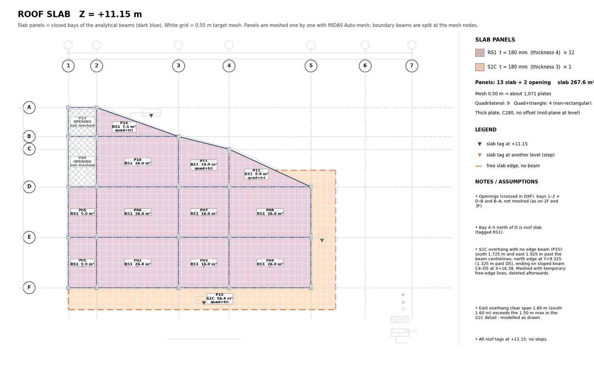
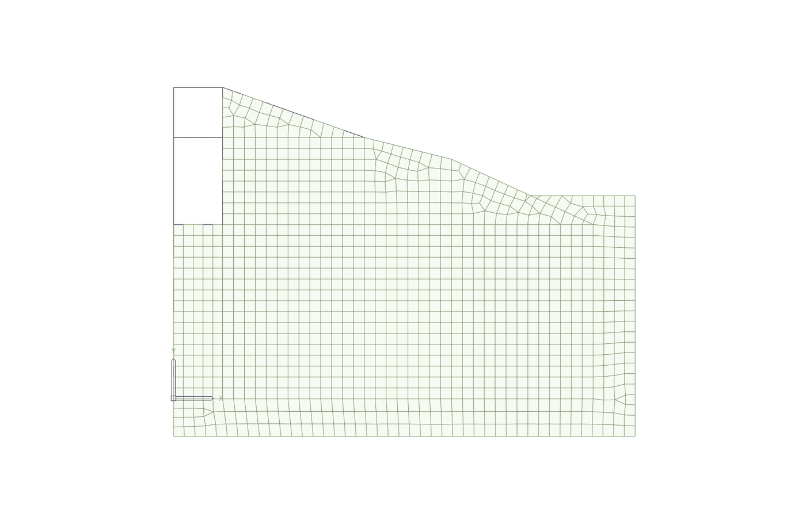

# 06 · Slabs with Auto-mesh

Goal: every slab panel meshed as plates that share nodes with the beams around it, at the
**beam level**, with openings left out and cantilevers handled, verified panel by panel.

Fire-station settings: element size **0.50 m**, thick plates, material C280, slabs at the
beam level (local SFL steps ignored), GS1 carried by the ground beams (a suspended slab).

| Slab | Thickness ID | t (mm) |
|---|---|---|
| GS1 | 1 | 200 |
| S1 | 2 | 180 |
| S1C (cantilever) | 3 | 180 |
| RS1 | 4 | 180 |

---

## 1. Panels = faces of the beam graph (`slab_faces.py`)

Treat the level's beams as a planar graph and walk its faces: at each node sort neighbours by
angle, and from each directed edge always take the most clockwise turn. Faces with positive
(CCW) area are panels; the outer face is negative and dropped. `simplify()` removes collinear
vertices to give true corners.

Each panel gets: polygon (on beam centrelines), corners, area, boundary beam IDs, and

- **slab type** from the `Sym-SFL` tags inside it (majority); if none is inside (small or
  sloped panels), the nearest tag within 3 m, flagged on the sheet;
- **mesh type**: `Quadrilateral` for a 4-corner orthogonal panel, else `Quad and Triangle`;
- estimated plate count = area / 0.5².

## 2. Openings

An opening is a closed `S-EDGE_SLAB` polyline crossed by an `S-GRID` diagonal (the drafting
convention for "no slab"). Openings under **1 m²** are ignored (shafts, sleeves). A panel whose
centroid is inside a modelled opening is marked `OPENING` and not meshed.

## 3. Cantilevers with no edge beam

Auto-mesh needs a closed boundary of line elements. For an overhang with a free edge:

1. Define the cantilever polygon (on beam centrelines) and its **free edges** explicitly.
2. `free_prepare`: make every polygon vertex a node. If a vertex lies inside an existing beam,
   **split that beam** at the new node. Add temporary beam lines along the free edges.
3. Mesh the panel against the real beams + temporary lines.
4. `free_cleanup`: delete every line element lying on the free edges (the temporary lines *and*
   the pieces Auto-mesh split them into). Check that the element count drops by exactly that
   number.

Fire station: 2F S1C wrap (1.725 m from the beam centreline), RF S1C overhang (south 1.725 m,
east 1.925 m, north to Y = 9.325).

**Order matters.** Run `free_prepare` for **all** cantilever panels of the level **before
meshing any panel**. A vertex added later splits a beam in the middle of an already-meshed
plate edge and leaves a hanging node (this happened on RF-P12 and needed a re-mesh).


*Roof slab sheet: RS1 panels, two openings left empty, and the S1C overhang with its free edges.*

## 4. The Auto-mesh call (`slab_build.py <KEY> <L> [n|a-b|verify]`)

One call per panel. Before each call, re-read the model and find the **current** boundary beam
pieces geometrically (neighbouring panels have already split them):

```python
T = [eid for eid,(pa,pb) in level_beams.items()
     if any(on_seg(pa,a,b) and on_seg(pb,a,b) for a,b in panel_edges)]
cover = sum(math.dist(*level_beams[t]) for t in T)
if abs(cover - perimeter) > 5: sys.exit("STOP: boundary not fully covered")   # mm
```

```json
POST /ope/AUTOMESH
{"Argument":{
  "MESHER":{"METHOD":"Line Elements","TARGETS":[…beam ids…],"TYPE":"Quadrilateral",
            "MESH_INNER_DOMAIN":false,
            "INCLUDE_INTERIOR_NODES":{"OPT_CHECK":false},"INCLUDE_INTERIOR_LINES":{"OPT_CHECK":false},
            "INCLUDE_BOUNDARY_CONNECTIVITY":true},
  "MESH_SIZE":{"LENGTH":0.5},
  "PROPERTY":{"ELEMENT_TYPE":"Plate","ELEMENT_SUB_TYPE":{"TYPE":"Thick"},"MATERIAL":1,"THICKNESS":2},
  "DOMAIN_NAME":{"NAME":"2F-P07"},
  "ADDITIONAL_OPTION":{"DELETE_LINE_ELEM":false,"SUBDIVIDE_LINE_ELEM":true}}}
```

`SUBDIVIDE_LINE_ELEM: true` splits the boundary beams at the mesh nodes, so plates and beams
share nodes.

**Behaviour to code around:**

| Behaviour | Handling |
|---|---|
| The reply also lists the split beam pieces | Keep only `TYPE == "PLATE"` as plates |
| An edge already split finer than the mesh size → MIDAS replies with a **warning only**, but the mesh is created | Find new elements by **diffing ELEM before and after**, never from the reply |
| A `DOMAIN_NAME` already in use → the mesh fails | Check `/db/MADO`; retry as `<name>-2`, `-3` … |
| The mesher reports failure on an awkward panel | Fallback sequence: panel type → Quad and Triangle → Quadrilateral → Quad and Triangle at 0.4 m → Triangle |
| Domain tables (`MADO`, `SBDO`, `DOEL`) are **read-only** through the API | Organise panels with structure groups instead (below) |
| Split pieces inherit the parent's groups and become members (`/db/MEMB`) | Beam groups stay complete; select beams by group, not ID range |

## 4.1 Voids, interior nodes and lines, drop panels (probe, BANWA 2, 07/10/2026)

The JSON manual (MIDAS support article 35736427971225, "Auto-Mesh Planar Area") gives the interior options as
objects; a probe on a throwaway copy of a live model confirmed them and the drop-panel flow below.

```json
"MESHER":{"METHOD":"Line Elements","TARGETS":[…outer loop…, …inner loop…],"TYPE":"Quadrilateral",
          "MESH_INNER_DOMAIN":false,
          "INCLUDE_INTERIOR_NODES":{"OPT_CHECK":true,"OPTION":"User","VALUE":[…node ids…]},
          "INCLUDE_INTERIOR_LINES":{"OPT_CHECK":true,"OPTION":"User","VALUE":[…line elem ids…]},
          "INCLUDE_BOUNDARY_CONNECTIVITY":true}
```

| Option | What it does (probe result) |
|---|---|
| `TARGETS` with an outer loop **and** a closed inner loop, `MESH_INNER_DOMAIN: false` | The inner loop is a **void**: no plate inside it (0 of 168). The inner loop lines are subdivided at the mesh nodes like the outer ones |
| `INCLUDE_INTERIOR_NODES` `"OPTION":"User"` + `VALUE` | Each listed node becomes a mesh node (a column node in the slab). Nodes not listed are ignored, also those inside a void. `"Auto"` detects every node inside the area: use `"User"` so nothing unplanned is taken in |
| `INCLUDE_INTERIOR_LINES` `"OPTION":"User"` + `VALUE` | A listed beam inside the area (ends on the boundary) is subdivided at the mesh nodes and the plates follow it |
| `TYPE` | The manual's example spells it `"Quadandtriangle"`, the specification `"Quad and Triangle"`; `"Quadrilateral"` was enough in every probe trial |

**Drop panel flow** (a pile-supported flat slab; one bay 6 × 6 m, drop 1.2 × 1.2 m, pile 350 × 350):

1. The pile stub as a beam element from the pile foot to the slab, pinned at the foot (`CONS` `"1110000"`).
2. 8 reserved nodes on the pile face (3 per side: corners and mid-sides) at the slab level, for the rigid zone.
3. The drop outline as 4 temporary line elements (a probe section), not meshed.
4. Slab: `AUTOMESH` on the outer loop + the drop outline, `MESH_INNER_DOMAIN: false`, the slab thickness. The drop
   is left void and its outline is subdivided at the slab mesh nodes.
5. Drop: re-read `ELEM`, find the **subdivided** outline pieces geometrically (the first piece keeps the old ID, the
   others are new), and `AUTOMESH` on them with the 8 nodes + the pile head as `"User"` interior nodes, the drop
   thickness. The reply is a warning only ("Quadrilateral mesh elements will be switched to Quad+Triangle … minimum
   edge size 0.4 m"), but the mesh is made: 14 quadrilaterals, the pile head patch 4 quads of 0.175 m.
6. Conformity: the plate edges used by one plate only are all on the outer loop (48 of 48), none on the drop
   outline, no edge used by three plates.
7. Rigid link, master the pile head:
   `PUT /db/RIGD {"Assign":{"<pile head>":{"ITEMS":[{"ID":1,"GROUP_NAME":"","DOF":111111,"S_NODE":[…8 nodes…]}]}}}`
   (DOF digits DX DY DZ RX RY RZ, 1 = rigid). It reads back as written.
8. Delete the temporary outline lines **by ID** (`DELETE /db/ELEM/<ids>` with `{}`, 200 IDs per call). The plates
   and the subdivided ground beams stay; no orphan nodes.

**IDs and replies.**
- New nodes and elements continue from the highest ID in the model.
- On a clean mesh the reply is `{"AUTOMESH": {…every new element…}}`: the plates and the split line pieces.
- The target lines come back changed: they are shortened to the first piece.
- Still diff `ELEM` before and after (§4).
- A real ground beam can be part of the boundary: it is split at the mesh nodes and every piece stays on plate nodes.

First zone (16 x 6 m, 8 drops, BANWA 2 r23):
- The slab reply was a warning, "switched to Quad+Triangle": the 1.2 m drop sides split in 3 do not match the 0.5 m
  grid. The result was 451 plates, 33 of them triangles, minimum angle 21.8°.
- **One AUTOMESH call meshed all 8 drop loops** (90 lines, 72 interior nodes); every drop took its 9 nodes.
- A zone edge with no beam is kept as a temporary seam line, so the next zone meshes against its nodes. The seam
  pieces are deleted by ID once plates lie on both sides of them (08 §2).
- **A seam keeps its nodes only when the next zone uses the same mesh size or a larger one.** A probe meshed a 0.40
  zone against 0.50 m seam pieces: every piece was split in two, and none of the plate edges on the far side was
  shared, so the two meshes did not connect.
  - Choose the mesh size before the first zone.
  - At 0.40 the 1.2 m drop sides (3 × 0.40) line up with the grid. On BANWA 2 Z1 (58 × 6 m, 29 drops) this gave a
    regular mesh with about 3 % of the plates under 45°, all of them round the drops.
- Proven later on the whole BANWA 2 ground floor (08/10/2026):
  - all drop loops of a zone in **one** call (138 drops, 1 242 interior nodes);
  - interior beams meeting at T-junctions as `INCLUDE_INTERIOR_LINES`;
  - an opening made by deleting the plates inside it, **then its loose mesh nodes** (`DELETE /db/NODE/<ids>`);
  - a slab joined to a wall top through temporary lines between the wall's nodes.
- The full method (zones, seams, rigid zones, the verification and the lessons) is
  [08 · Pile-supported flat slab](08_PILE_SUPPORTED_FLAT_SLAB.md).

Plates inside the 8-node patch sit in the rigid zone, which is accepted. The slab quads next to the drop are
paved, not mapped: check the element quality in the full layout.

## 5. Per-panel check (inside the loop)

For the new plates of each panel: area equals the panel area (± 0.01 m²), all nodes at the
level Z, triangle count printed. Any mismatch → STOP. Progress is saved to
`fs_slab_<L>_done.json`, so a re-run skips finished panels.

## 6. Level verification (`slab_build.py <KEY> <L> verify`, also run BEFORE and AFTER)

| Check | Pass |
|---|---|
| Plates and total area | Area equals the sheet total |
| Beams at level: count and **total length** | Length unchanged by splitting (GB: 53 → 391 pieces, 190.800 m before and after) |
| Plate edges used by one plate only | All on a slab free edge (cantilever edges); **0 others without a beam** |
| Plate edges on a beam line without a beam of the same node pair | 0 (otherwise a plate is not connected to the beam) |
| Duplicate nodes at the level | 0 |
| Beam pieces outside `BEAM_<L>` | 0 (add them if any) |

## 7. Groups

- Level group `SLAB_<L>` (GRUP 13–17) with all plates of the level.
- One group per panel `SLAB_<L>-Pxx`, ID = level base + panel number (GB 100, 2F 200, 3F 300,
  RF 400, AR 500). This replaces domains/sub-domains for navigation in the works tree.
- **`PUT /db/GRUP` merges `E_LIST`** into an existing group. Never write beams into a slab
  group; to remove members, delete the group and PUT it again.

## 8. Re-meshing one panel (`redo_panel.py`)

Delete the panel's plates and any orphan nodes, run the cantilever preparation for the whole
level again, then mesh the panel under a **new domain name** (`RF-P12-2`).

## 9. Result on the fire station

| Level | Panels | Plates | Area (m²) |
|---|---|---|---|
| GB (GS1) | 19 | 1,237 | 296.21 |
| 2F (S1 + S1C) | 23 (3 openings skipped) | 1,333 | 306.89 |
| 3F (S1) | 20 (2 openings skipped) | 991 | 229.07 |
| RF (RS1 + S1C) | 13 (2 openings skipped) | 1,089 | 267.60 |
| Annex roof (RS1) | 2 | 125 | 26.54 |
| **Total** | | **4,775** | |

Model after slabs: 5,120 nodes, 6,368 elements (1,593 beam pieces, 4,775 plates).


*The roof after Auto-mesh in MIDAS (plan view).*

## Pitfalls

- Meshing before all cantilever vertices exist → hanging nodes.
- Trusting the Auto-mesh reply → missed plates on warning-only replies.
- Rounded half-millimetre coordinates failing an on-segment test → add a tolerance *along* the
  segment too (`e = tol / sqrt(L²)`), not only across it.
- Modelling slabs at the local SFL step → plates offset from the beams; the rule is slab = beam
  level.
