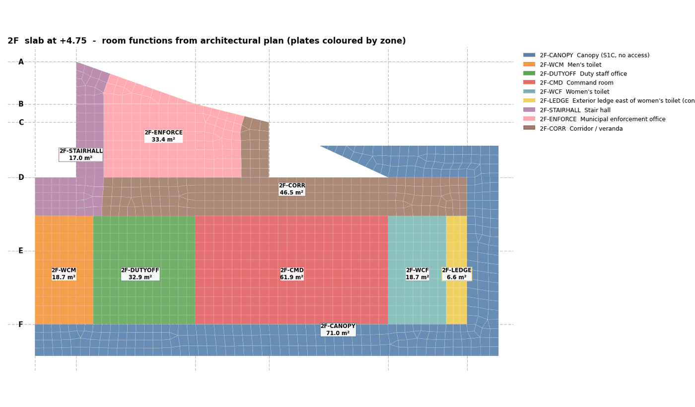
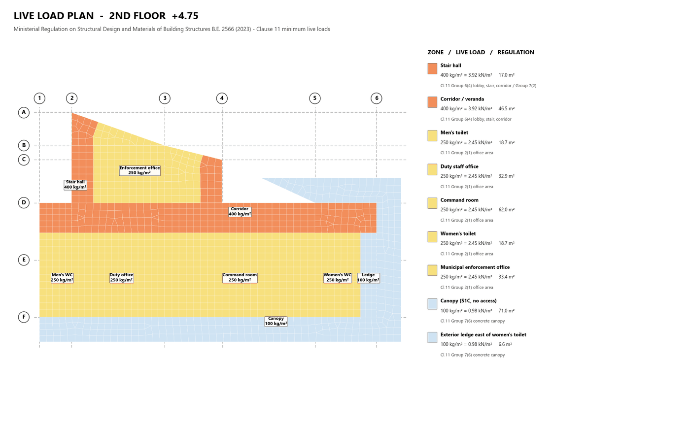

# 07 · Room Functions from the Architectural Plan

Goal: every slab plate tagged with the room function it carries, so live load can be
classified per the building regulation and applied plate by plate, with maps the engineer
can check against the architectural plan.

---

## 1. Read the AR plan

The AR plan PDF (fire station: `B - Floor Plan.pdf`, sheets A1-01…A1-04) has room names in
Thai. Its text does **not** extract usefully, so:

1. Render each page to PNG with PyMuPDF (`fitz`) at a readable DPI (`ar_p<n>.png`).
2. Crop the plan area (`ar_p<n>_plan.png`) and read the rooms visually.
3. Note for each room: name (Thai and English), boundaries **in terms of grid lines and
   dimensioned walls**, and any equipment (water tanks, pumps) that affects load.

## 2. Align the AR plan with the structural model

Both plans share the grid. Express every room boundary in **structural coordinates** (mm,
grid 1 / F = origin, beam-centreline grid): grid values directly, or grid + dimension for
walls between grids (e.g. X = 3,175 for a toilet wall, X = 11,280 for an office wall).

If an AR grid differs from the structural grid, compute a 2-point transform from two shared
grid intersections and apply it to every boundary before use.

## 3. Zones (`rooms.py`)

Zones are defined per level as an **ordered list; first match wins**. That lets a small room
be declared before the large room around it, with the big room as a catch-all rectangle.

```python
R = lambda x0,x1,y0,y1: [(x0,y0),(x1,y0),(x1,y1),(x0,y1)]
BIG = 99999
"2F": [
  dict(id="2F-CANOPY", en="Canopy (S1C, no access)", panels=["2F-P26"]),   # by slab panel group
  dict(id="2F-WCM",    en="Men's toilet",            rects=[R(0,3175,0,5900)]),
  ...
  dict(id="2F-CORR",   en="Corridor / veranda",      rects=[R(3875,23550,5900,8000), R(11280,12750,8000,BIG)])]
```

- A zone can be selected by **rectangles** (plan geometry) or by **slab panel group**
  (`SLAB_<L>-Pxx`), which is cleaner for cantilevers and canopies.
- Each plate is assigned by its **centroid**. Plates come from the level group `SLAB_<L>`.
- **UNASSIGNED must be 0** for every level. Print it and stop if not.
- Point features (water tanks) are stored separately as `EXTRA` markers.

Output: `fs_rooms.json` (zone per plate, area and panels per zone) and one colour map per
level (`fs_rooms_<L>.png`: plates coloured by zone, zone ID and area at the zone centre, grid
lines, legend with English names).

Fire station: 26 zones over 5 levels, every one of the 4,775 plates classified.


*2F plates coloured by room zone, with zone ID and area.*

## 4. Things to confirm with the engineer

Raise these on the map rather than assuming:

- the ground floor function that governs (fire-truck parking, 800 kg/m²);
- equipment areas (roof water tanks: 2 × 1.5 m³). The engineer set **5 kPa** over the tank area
  (zone RF-TANK, X 3.1–7.6 m, row F to Y = 2.6 m, 11.25 m²);
- exterior ledges and canopies: accessible or not;
- parts of the building **not in the structural model** (stair roof at +14.15 over bays 1–2).

## 5. Live-load classification

Map each zone to a row of the regulation's live-load table (Ministerial Regulation B.E. 2566,
clause 11) and keep the mapping in `fs_LL.json`:

| Use | kg/m² | Fire-station zones |
|---|---|---|
| Parking for fire trucks | 800 | GB-TRUCK |
| Storage, pump room | 500 | GB-STORE, GB-PUMP |
| Stairs, halls, corridors | 400 / 300 | stair halls, corridor / veranda |
| Offices, 2F toilets | 250 | duty office, command room, enforcement office |
| Dormitory / rest rooms, 3F toilet | 200 | 3F-REST, 3F-WCM |
| Roof deck (accessible) | 200 | RF-DECK |
| Concrete canopy, non-accessible roof | 100 | canopies, annex roof |
| Water-tank area (engineer's value) | 5 kPa | RF-TANK |

Produce one LL plan per level (`ll_plot.py [--en]` → `fs_LL_<L>(_en).png`): plates coloured
by load, zone labels with the value and the clause, in English for the report. Use a short
label dictionary for small zones so labels do not overlap.

Clauses 13/14 (live-load reduction) are checked per use: **no reduction for parking**.


*2F live-load plan for the report (values and regulation clause per zone).*

## 6. Apply to the model

`apply_LL.py` writes `/db/PRES` on every plate (case LL, GZ, `FORCES: [-q, 0, 0, 0, 0]` in kPa).
It refuses to run if PRES already holds data, because PUT merges by item ID; SDL is added
later as item ID 2 of each PRES entry (`apply_SDL.py`, 2.50 kPa over the whole area).
Check the reaction totals after analysis against Σ(q × area) per case.

Load application details and combinations are in the calculation-report guide
(`CALC_REPORT_GENERATION.md`).
