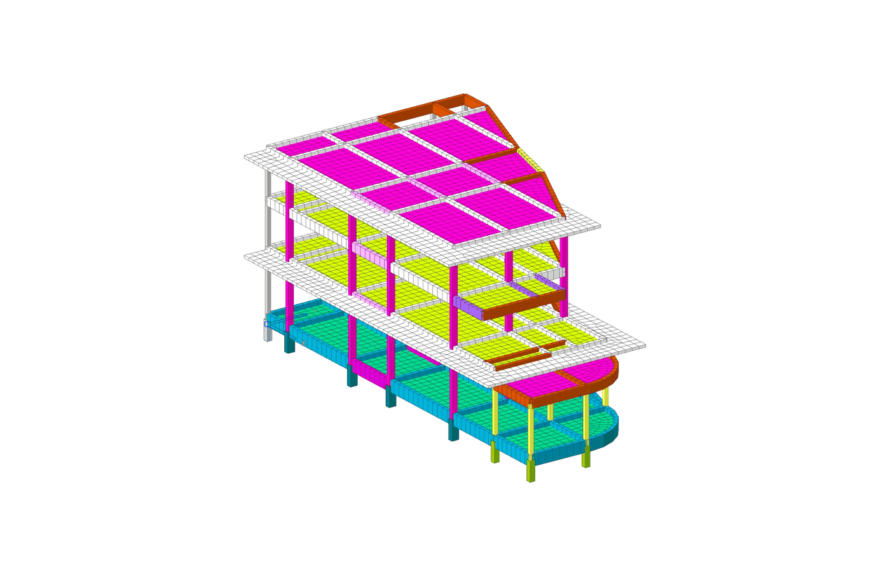

# Modelling from Drawings → Live MIDAS GEN NX

> **Copied** from [`konohatrong/midas_API`](https://github.com/konohatrong/midas_API/tree/b4155ac/modeling-guide) (`modeling-guide/`, commit b4155ac, 2026-10-04) into this repository's `midas/` folder, unchanged except this note. Paths such as `pilot project/…` name that repository; the map is in [`midas/README.md`](../README.md).

A field guide for turning a **structural plan DXF** (plus the **architectural plan** and the
**detail/schedule PDF**) into an analytical model written **directly into a live MIDAS GEN NX
session over the MAPI**, one level at a time, with a verification gate before every write.

It captures the method proven on the Samut Songkhram **fire station (Building B)**, 2026-09:
26 columns, 5 beam levels, one curved corner beam on two levels, an annex at a split level,
and 4,775 slab plates meshed with Auto-mesh. The guide is written generically; fire-station
values are given as worked examples.

> **Security.** The MAPI key is a credential. Pass it only as a command-line argument
> (`sys.argv[1]`). Never write it into a file, doc, log, commit or memory.

---

## The pipeline

```
 DXF structural plan ─┐
 Detail / schedule PDF├─► 1 INTAKE ──► 2 GRID + COLUMNS ──► 3 BEAMS ──► 4 CURVES → CHORDS
 AR plan PDF ─────────┘      │                                                │
                             ▼                                                ▼
                     drawing review            5 VERIFY (offline sheet + checks + user "Go")
                     decision list                        │
                                                          ▼
                                     write ONE level to live MIDAS → read back → next level
                                                          │
                                                          ▼
                             6 SLABS (Auto-mesh) ──► 7 ROOM FUNCTIONS (AR plan) → loads
```

Every arrow into MIDAS goes through the gate in [05](05_PRE_MODEL_VERIFICATION.md). Nothing
reaches the live model until it has (1) passed the automatic checks, (2) been drawn on a
review sheet over the original drawing, and (3) been accepted by the engineer.

## The guides

| # | File | What it covers |
|---|---|---|
| 1 | [01_DRAWING_INTAKE.md](01_DRAWING_INTAKE.md) | Reading the DXF (layers, xrefs, several plans on one sheet, displaced copies), the schedule PDF, the AR plan PDF; the first review and the decision list |
| 2 | [02_GRID_AND_COLUMNS.md](02_GRID_AND_COLUMNS.md) | Grid from the xref, column detection from dynamic blocks, snapping to grid, levels from SFL tags, column tops, ID scheme, first MIDAS write |
| 3 | [03_BEAM_LAYOUT.md](03_BEAM_LAYOUT.md) | Beam centrelines from MLINE and edge pairs, mark assignment, snapping and clustering, junction splitting, mark inference, trimmer removal, connectivity |
| 4 | [04_CURVED_BEAMS.md](04_CURVED_BEAMS.md) | Arc recovery from polyline bulges, centreline, choosing the chord count (sagitta), node snapping, reuse on other levels |
| 5 | [05_PRE_MODEL_VERIFICATION.md](05_PRE_MODEL_VERIFICATION.md) | The review sheet, the 5-check independent verification, pre-write and post-write checks, backups, the per-level loop |
| 6 | [06_SLAB_AUTOMESH.md](06_SLAB_AUTOMESH.md) | Slab panels from the beam graph, openings, cantilevers without edge beams, Auto-mesh payload and pitfalls, slab verification, groups |
| 7 | [07_AR_PLAN_ROOM_MAPPING.md](07_AR_PLAN_ROOM_MAPPING.md) | Mapping room functions from the architectural plan onto the slab plates, live load classification |
| 8 | [08_PILE_SUPPORTED_FLAT_SLAB.md](08_PILE_SUPPORTED_FLAT_SLAB.md) | Ground floor on piles: flat slab with drop panels, pile stubs, 8-node rigid zones, ground beams, gutter strip. **Staged build** (beams → outlines → piles → slab → drops / strip, one revision each; §2A) and the zone method; the verification; BANWA 2 example |
| – | [DECISION_LOG_TEMPLATE.md](DECISION_LOG_TEMPLATE.md) | The questions every project has to answer before modelling, with the fire-station answers as an example |

The analysis-and-report side (loads, combinations, results, docx report) is in
[`pilot project/wind load generator/docs/CALC_REPORT_GENERATION.md`](../calc-report/CALC_REPORT_GENERATION.md).

## Folder layout

```
modeling-guide/
├── README.md                     this index
├── 01_…07_*.md                   topic guides
├── DECISION_LOG_TEMPLATE.md      questions to settle before modelling
├── img/                          figures used in the guides (fire-station examples)
└── scripts/fire_station/         archived reference scripts, by stage (see its README)
```

## Conventions used throughout

| Item | Convention |
|---|---|
| Units | DXF in **mm**; all processing in mm; MIDAS written in **m** (divide by 1000 at the write step only) |
| Origin | Grid 1 / grid F intersection = (0, 0). X along number grids, Y along letter grids |
| Column position | On the grid intersection (construction offsets removed for analysis) |
| Beam line | Beam centreline; slabs at the **beam level**, not the local SFL step |
| Level of a floor | The typical SFL of the plan (majority of level tags); local drops ignored |
| Work unit | One level per write. The engineer reviews and says "Go" for each |
| Intermediate data | JSON per stage (`fs_colmodel.json`, `fs_beammodel.json`, `fs_slab_<L>.json` …) so every stage can be re-run offline |

## Reference implementation (fire station)

The scripts that implemented this guide are archived in
[`scripts/fire_station/`](scripts/fire_station/README.md), one folder per stage
(`01_intake` … `09_checks_report`), with the run order, which scripts write to the live model,
and the project values to change for another building. The guides name the scripts so the
logic can be traced.



## Technique log (append new techniques here)

Add one line per new technique or pitfall, with the date and the guide it was folded into.

| Date | Technique / pitfall | Guide |
|---|---|---|
| 2026-09-24 | Guides moved to `modeling-guide/`; scripts archived by stage; figures added | – |
| 2026-09-23 | Grid bubbles and grid lines live inside the grid **xref block**, not in modelspace | 02 |
| 2026-09-23 | Dynamic column blocks: size from **visible** entities only | 02 |
| 2026-09-23 | MLINE centreline needs the **justification** shift (top / zero / bottom) | 03 |
| 2026-09-23 | Curved beams are **bulged LWPOLYLINEs**; reading vertices only gives a false straight chamfer | 04 |
| 2026-09-23 | A plan can hold a **displaced copy** of a bay; detect and transform back before tracing | 01 |
| 2026-09-24 | Auto-mesh: split the boundary at every panel vertex **before** meshing any panel (no hanging nodes) | 06 |
| 2026-09-24 | Cantilever slab with no edge beam: temporary edge lines → mesh → delete the lines | 06 |
| 2026-09-24 | `PUT /db/GRUP` merges `E_LIST`; delete and re-PUT to remove members | 06 |
| 2026-09-24 | Thai text in the AR PDF does not extract; read the pages as images and key zones to the grid | 07 |
| 2026-10-07 | Auto-mesh voids (inner loop, `MESH_INNER_DOMAIN` false), interior nodes / lines as `"OPTION":"User"`, drop panels meshed after the slab through the reserved nodes; `/db/RIGD` format | 06 §4.1 |
| 2026-10-07 | A seam keeps its nodes only for the same (or a larger) mesh size: a 0.40 mesh split every 0.50 m seam piece | 08 §6.1 |
| 2026-10-07 | Big floor in zones, one model revision each (`SAVEAS`), a snapshot after each as the next zone's reference; seams kept until both sides are meshed | 08 §2 – §3 |
| 2026-10-08 | Snap new lines to the existing nodes of a meshed beam (set-back beam 1.25 → 1.20, gutter strip 1.6 → 2.0) | 08 §5.2 |
| 2026-10-08 | Check every support type before the first zone: drops over columns with no ground beam were missed and the floor was rebuilt | 08 §8 |
| 2026-10-08 | Opening by deleting the plates inside it, then its loose nodes by ID; checks exempt the beams beside it in every zone | 08 §5.3 |
| 2026-10-08 | Staged build over the whole floor (beams → outlines → piles → slab by region → drops / strip → links); no seams | 08 §2A |
| 2026-10-08 | Local refinement: pre-split the drop / strip outline at 0.20 in a 0.40 slab; drops 0 % under 45 deg (0.40: 11 %) | 08 §2A, 06 §4.1 |
| 2026-10-08 | Pre-split with ceil(L / size); re-read NODE after each mesh call; compare coordinates at 4 decimals | 08 §2A |
